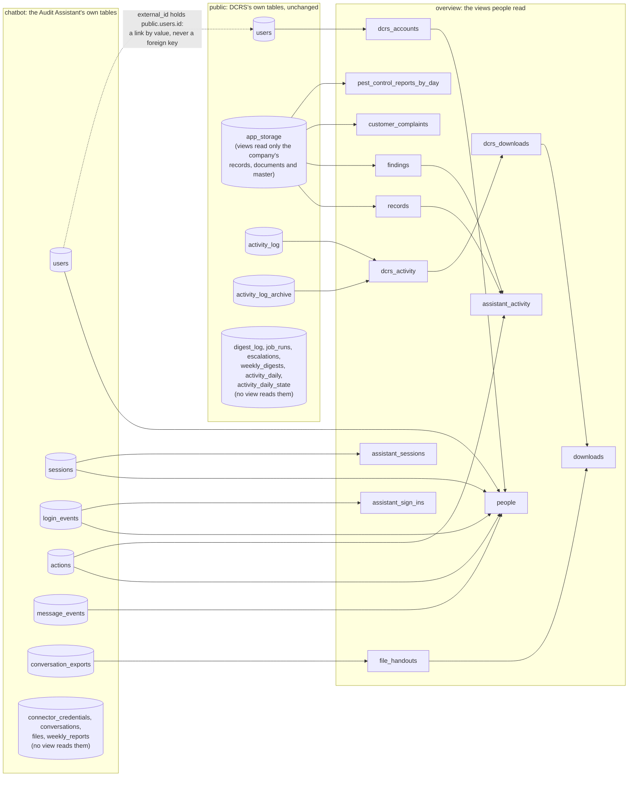

# The shared database of DCRS and the Audit Assistant

DCRS and the Audit Assistant keep their data in **one PostgreSQL database**: DCRS's own database
(REQUIREMENTS §83). Nothing is copied between them.

- DCRS's tables stay exactly where and as they are, in the schema `public`.
- The Audit Assistant keeps its tables in a schema of its own, `chatbot`.
- The schema `overview` holds plain-English **views** over both, one row per real-world thing, for
  people to read. A view holds no data of its own: it reads the live tables, so a change made in
  either system shows in it at once.

DCRS stays the only writer of DCRS's data. The Audit Assistant never reads or writes DCRS's tables:
it changes DCRS's data only through the DCRS API, as the person signed in
([docs/chatbot-integration.md](../chatbot-integration.md)).

Every table, view and column is described in the [data dictionary](data-dictionary.md).

**Contents**

1. [The map: three schemas](#1-the-map-three-schemas)
2. [How the tables and views relate](#2-how-the-tables-and-views-relate)
3. [The roles, and exactly what each may do](#3-the-roles-and-exactly-what-each-may-do)
4. [Setting it up: on a copy, test it, then the real database](#4-setting-it-up-on-a-copy-test-it-then-the-real-database)
5. [The viewer for staff: "Database overview" in DCRS](#5-the-viewer-for-staff-database-overview-in-dcrs)
6. [Example questions, with their SQL](#6-example-questions-with-their-sql)
7. [What no view ever shows, and how that is proved](#7-what-no-view-ever-shows-and-how-that-is-proved)
8. [The data dictionary](#8-the-data-dictionary)
9. [Backups](#9-backups)
10. [Good to know](#10-good-to-know)

## 1. The map: three schemas

| Schema | Whose | What is in it | Who makes and changes it |
|---|---|---|---|
| `public` | DCRS | DCRS's own tables: `users` (sign-in accounts), `app_storage` (every record, form and master list, as JSON), `activity_log` and its archive, and DCRS's smaller tables (escalations, digests, scheduled jobs). | DCRS itself, when it starts. The shared set-up changes nothing here. |
| `chatbot` | The Audit Assistant | Its ten tables: `users`, `sessions`, `connector_credentials`, `login_events`, `conversations`, `actions`, `message_events`, `files`, `conversation_exports`, `weekly_reports`, and its migration ledger. | The Audit Assistant's own migrations, when it starts. |
| `overview` | Everyone who reads | 13 views and 12 small helper functions. No data of its own. | `npm run db:shared -- setup`, from the files in `database/sql/`. |

The files:

| File | What it does | Applied |
|---|---|---|
| `database/sql/01-schemas-and-roles.sql` | Part 1: the schemas `chatbot` and `overview`, and the roles `audit_assistant`, `overview_viewer` and `overview_owner` with their limits and grants. | Always |
| `database/sql/02-overview-dcrs.sql` | Part 2: the seven views over DCRS's data. | Always |
| `database/sql/03-overview-chatbot.sql` | Part 3: the six views over the Audit Assistant's tables. | With `--with-chatbot`, once the assistant has made its tables |
| `database/sql/optional/dcrs-table-comments.sql` | Plain-English comments on DCRS's own tables and columns. Metadata only, but it touches DCRS's tables, so it is the owner's call. | Only with `--with-dcrs-comments` |
| `database/sql/optional/chatbot-table-comments.sql` | Plain-English comments on the assistant's tables, for its developer to fold into its own migrations. | Only with `--with-chatbot-comments` |

The views:

| View | One row per | Reads |
|---|---|---|
| `overview.dcrs_accounts` | DCRS sign-in account (never the password) | `public.users` |
| `overview.records` | filled-in form (a record) | `public.app_storage`: the company's `records` and `documents` |
| `overview.findings` | internal CAPA finding, with its readable id (for example `CAPA-2023-12-13-1`) and the status DCRS shows | `public.app_storage`: `records` |
| `overview.customer_complaints` | customer complaint checklist (F/MKT/05) | `public.app_storage`: `records` |
| `overview.pest_control_reports_by_day` | calendar day of the Daily Pest Control Monitoring Record (F/HR/17), the days with no record included | `public.app_storage`: `records` |
| `overview.dcrs_activity` | line of DCRS's activity log, the archive included | `public.activity_log`, `public.activity_log_archive` |
| `overview.dcrs_downloads` | download, print or upload in DCRS | `overview.dcrs_activity` |
| `overview.people` | DCRS account, with how the person uses the Audit Assistant | `overview.dcrs_accounts` and the assistant's `users`, `login_events`, `sessions`, `message_events`, `actions` |
| `overview.assistant_sessions` | device signed in to the Audit Assistant | `chatbot.sessions`, `chatbot.users`, `overview.dcrs_accounts` |
| `overview.assistant_sign_ins` | attempt to sign in to the Audit Assistant | `chatbot.login_events`, `chatbot.users`, `overview.dcrs_accounts` |
| `overview.assistant_activity` | action the Audit Assistant took or proposed in DCRS, tied to the DCRS record and finding | `chatbot.actions`, `chatbot.users`, `overview.dcrs_accounts`, `overview.records`, `overview.findings` |
| `overview.file_handouts` | time data left the Audit Assistant for a device (the trail after a data breach) | `chatbot.conversation_exports`, `chatbot.users`, `overview.dcrs_accounts` |
| `overview.downloads` | download, print or hand-out in either system | `overview.dcrs_downloads`, `overview.file_handouts` |

Times: a moment is shown twice, in the factory's time (`..._factory_time`, Asia/Kolkata) and in
UTC (`..._utc`). A day is a date (`..._date`). "Today" is the factory's today. Only live records
appear, never Demo Mode's.

## 2. How the tables and views relate



- **The one link between the two systems** is a value, not a foreign key: `chatbot.users.external_id`
  holds the person's DCRS account id (`public.users.id`), with `chatbot.users.provider = 'dcrs'`.
  The view `overview.people` joins on it. No foreign key crosses between the two applications'
  schemas: neither application's tables depend on the other's.
- **Inside `chatbot`** the assistant's own foreign keys hold: almost every row points to its person
  (`user_id` → `chatbot.users.id`) and to the device's session (`session_id` → `chatbot.sessions.id`);
  `connector_credentials` belongs to a session, and `files` to a conversation.
- **Names come from DCRS.** The views over the assistant's tables also read `overview.dcrs_accounts`
  (not drawn, to keep the picture readable), so a person is named as DCRS names them.
- **The assistant's actions reach DCRS's records by what they were given.** The function
  `overview.assistant_action_targets(action, input)` reads the record, the finding or the day from
  an action's input. It is the one place to change when the assistant's DCRS actions change.
- **Every arrow into a view is a read by that view's owner.** The seven views over DCRS belong to
  the role that owns DCRS's tables (so nothing on DCRS's tables is granted to anyone). The six views
  over the assistant's tables belong to `overview_owner`, which may read only their harmless columns.

## 3. The roles, and exactly what each may do

| Role | Signs in? | May | May never |
|---|---|---|---|
| DCRS's own role (`dcrs`, or `postgres` on the built-in database) | Yes: DCRS | Everything it does today, on its own tables. It also owns the seven views over DCRS's data. | (Unchanged: no new grant, no new power.) |
| `audit_assistant` | Yes: the Audit Assistant server | Own the schema `chatbot`: make, change and read its own tables there. `CONNECT` and `CREATE` on the database (see below). | Read or write any DCRS table or sequence; read any overview view; create anything in `public` or `overview`. |
| `overview_viewer` | Yes: the viewer ("Database overview" in DCRS) | `SELECT` on every overview view (7, and 13 once part 3 is applied), and run their helper functions. | Read any table in `public` or `chatbot`; insert, change or delete anywhere; create anything in `overview` or `public`. |
| `overview_owner` | **No**: never a person | Own the six views over the assistant's tables; read the harmless columns of six of the assistant's tables, and four of the DCRS views. | Read a secret column (below); read any DCRS table. |
| `PUBLIC` (every role) | | Nothing on DCRS's tables, nothing in `overview`. | |

The limits, set on the roles themselves (`database/sql/01-schemas-and-roles.sql`):

| | `audit_assistant` | `overview_viewer` |
|---|---|---|
| Connections at most | 20 (its pool holds 10; 20 lets an old and a new server overlap during a restart) | 5 (DCRS's viewer uses 2) |
| A statement is stopped after | 30 seconds | 60 seconds |
| A transaction left open and idle is ended after | 60 seconds | 60 seconds |
| Every transaction read-only unless it says otherwise | no | **yes** |
| Unqualified names mean | its own tables (`search_path = chatbot`) | the views (`search_path = overview`) |

None of the three roles is a superuser, can make roles or databases, bypasses row security, or is
a member of another role.

**Why `audit_assistant` has `CREATE` on the database.** Its migration tool runs
`CREATE SCHEMA IF NOT EXISTS "chatbot"` at every start. PostgreSQL checks the right to create schemas
in the database *before* it notices that the schema already exists. Without `CREATE` on the database
that statement fails with "permission denied for database", even though `chatbot` is already there
and belongs to the assistant. The tests prove both halves on a throwaway role. `CREATE` on the
database lets the role make new, empty schemas of its own; it gives no access to anything of DCRS.

## 4. Setting it up: on a copy, test it, then the real database

Rule 4 of the brief: build and test on a copy first; show the owner the plan and the results before
touching the real database.

**You need:**

- The DCRS repository on the machine you run the commands from (`npm install` done), with Node.js.
- A PostgreSQL superuser's address for each server (for example `postgres`). The views need
  PostgreSQL 16 or newer; the plant runs 18.
- For the copy only: PostgreSQL's command-line tools `pg_dump` and `pg_restore`, of the server's
  version or newer (on Windows, the installer's "Command Line Tools"; set `PG_BIN` if they are not
  on `PATH`).

Every command reads its database address from an environment variable. A password may be written
in the address (`postgres://postgres:<password>@host:5432/dcrs`) or left out of it and given in
`PGPASSWORD` (or `pgpass.conf`), which keeps it out of the shell's history. The examples are
PowerShell, as on the plant's Windows machines; in a Unix shell write `export NAME=value` instead of
`$env:NAME = "value"`.

**Step 1. Make a copy** of the real database on a scratch server (or as a new database on the same
server). The source is only read; the copy must be a new database.

```powershell
$env:SOURCE_DATABASE_URL = "postgres://postgres:<password>@db-host:5432/dcrs"
$env:COPY_DATABASE_URL   = "postgres://postgres:<password>@scratch-host:5432/dcrs_copy"
npm run db:shared -- copy
```

It dumps the source and restores it into the new database in one transaction, then checks that
every table holds the same number of rows as the source (counted in the same snapshot as the dump).
Roles the scratch server lacks are made there first, without passwords. It refuses to write over a
database that already exists. Add `--keep-dump <file>` to keep the dump file (it holds everything,
password hashes too: keep it safe).

**Step 2. Set it up on the copy.**

```powershell
$env:SUPERUSER_DATABASE_URL   = "postgres://postgres:<password>@scratch-host:5432/dcrs_copy"
$env:AUDIT_ASSISTANT_PASSWORD = "<a new password for the Audit Assistant>"
$env:OVERVIEW_VIEWER_PASSWORD = "<a new password for the viewer>"
npm run db:shared -- setup
```

`setup` applies parts 1 and 2, and sets the two passwords when they are given (at least 12
characters: letters, digits and punctuation). It does it all in **one transaction**: either all of
it is done or none of it. It says line by line what it did, and refuses, changing nothing, when the
address is not a superuser's. It is safe to run again. The passwords are sent to PostgreSQL as
SCRAM-SHA-256 hashes, never as the passwords themselves, so no server log can hold them. The roles
are the whole server's: on a scratch server with other databases, the passwords set here are theirs
too.

**Step 3. Test the copy.**

```powershell
npm run db:shared -- test
```

It runs `database/tests` against `SUPERUSER_DATABASE_URL`, as each role concerned, and changes
nothing: every write it tries is rolled back. With `AUDIT_ASSISTANT_PASSWORD` and
`OVERVIEW_VIEWER_PASSWORD` still set, it also signs in as the two logins for real. Set
`SHARED_DB_TEST_DUMP` to a dump of the real database (for example `copy --keep-dump`'s) and the check
"DCRS unchanged" restores that into a throwaway database of its own; without it, that check copies
the database under test instead, leaving out `overview` and `chatbot`. What it checks:

- `audit_assistant`: refused `SELECT`, `INSERT`, `UPDATE`, `DELETE` and `TRUNCATE` on every table in
  `public` (listed from the catalog), refused every sequence and every overview view; may run
  `CREATE SCHEMA IF NOT EXISTS chatbot` and make a table there; may not create in `public` or
  `overview`; owns no schema but `chatbot`; a real sign-in has its 30 s and 60 s limits; and the
  `CREATE`-on-the-database finding above, both halves, on a scratch role.
- `PUBLIC` holds no privilege on any DCRS table, view or sequence.
- `overview_viewer`: reads every view; refused every table in `public` and `chatbot`; cannot write or
  create anywhere; a real sign-in is read-only.
- `overview_owner` cannot read a single secret column (part 3).
- No view reaches a secret (section 7), and the four detectors behind that are shown to catch views
  made to break each rule.
- **DCRS unchanged**: a snapshot of `public` (tables, columns, types, defaults, indexes,
  constraints, triggers, owners, grants, comments) is the same before and after `setup`, run twice,
  on a freshly restored database; with `--with-dcrs-comments`, only comments change.
- **Live**: a finding closed in the stored records, as DCRS closes it, shows in `overview.findings`
  inside the same transaction, for the viewer.
- The readable finding id of the view equals the one the DCRS API gives
  (`backend/findingsCore.ts`), on every finding and on 33 made-up reports that hit every rule.
- The view's department map equals DCRS's own (`frontend/src/data/seed/documentDepartments.ts`).
- Every view's row count matches the data under it, and each view answers in under 5 seconds.

**Step 4. Show the owner** what `setup` and `test` printed. Nothing real has been touched yet.

**Step 5. Apply it to the real database.** The same command, pointed at it:

```powershell
$env:SUPERUSER_DATABASE_URL   = "postgres://postgres:<password>@db-host:5432/dcrs"
$env:AUDIT_ASSISTANT_PASSWORD = "<the Audit Assistant's password>"
$env:OVERVIEW_VIEWER_PASSWORD = "<the viewer's password>"
npm run db:shared -- setup
npm run db:shared -- test
```

DCRS may keep running: `setup` changes nothing DCRS uses. The test only reads and rolls back, but it
does make (and drop) a database of its own for the "DCRS unchanged" check, so run it on the real
server only if that is allowed there; otherwise the copy's result stands for it.

**Step 6. Start the Audit Assistant** with its `DATABASE_URL` set to
`postgresql://audit_assistant:<its password>@db-host:5432/dcrs`. It makes its tables in `chatbot`
the first time (what it must change first: [docs/chatbot-integration.md](../chatbot-integration.md)).

**Step 7. Add the views over the assistant's tables**, and test again:

```powershell
npm run db:shared -- setup --with-chatbot
npm run db:shared -- test
```

**Step 8 (optional).** Comments on the tables themselves, for database tools and the data
dictionary: `--with-chatbot-comments` (the assistant's tables) and `--with-dcrs-comments` (DCRS's
tables: the owner's call).

**Before an Audit Assistant migration** that drops or changes the type of a column the views read,
run `npm run db:shared -- setup --rebuild-views` (it drops every overview view and makes only the
DCRS ones again), let the assistant migrate, then `npm run db:shared -- setup --with-chatbot`.
Adding tables or columns needs nothing.

**To take the overview away again**: `DROP SCHEMA overview CASCADE;` as a superuser removes every
view and helper function and nothing else (tried on a copy: DCRS's `public` is exactly as before).
The two overview roles can then go: `DROP OWNED BY overview_viewer, overview_owner;` in each
database that uses them, then `DROP ROLE overview_viewer, overview_owner;`. Leave `audit_assistant`
while the Audit Assistant is in use: it owns the schema `chatbot`, which holds the assistant's data,
and `DROP OWNED BY audit_assistant` would delete it.

## 5. The viewer for staff: "Database overview" in DCRS

**For the super admin.** DCRS has a page called **Database overview** in its admin area: in the
sidebar, next to Users & Access. Only the super admin sees it. It reads the overview views, so it
shows what DCRS and the Audit Assistant hold, in plain words, as it is at this moment. Nothing on
the page can change anything.

- **Ask a question.** The questions come first, as big buttons: *Who downloaded or printed what last
  week?*, *Which CAPA findings are open?*, *Which pest control reports are missing this month?*,
  *What changed in DCRS through the Audit Assistant?*, and, once the Audit Assistant is connected,
  *What did the Audit Assistant do last week?* and *Who signed in to the Audit Assistant, from which
  device?* Press one and the answer appears below it. For the weekly questions, **Last week** and
  **This week** switch between the two; the dates are shown.
- **Read the answer.** A hundred rows at a time; **Show 100 more** reads the next hundred. Point at
  a column's heading to see what it means.
- **Browse everything.** Pick any view under **View**, narrow it by dates or a search, and press
  **Show**. Under the choice, the page says in a sentence what the view holds.
- **Take it away.** **Download as CSV** gives the rows as a file for Excel (up to 20,000 rows).

Every time the page is opened, and every CSV taken away, is written in DCRS's activity log.

**For whoever looks after the server.** The page needs the viewer's login: put
`OVERVIEW_DATABASE_URL=postgres://overview_viewer:<its password>@<database host>:5432/<DCRS database>`
in `backend/.env` and restart DCRS. Until then the page says it is not set up, and how.

## 6. Example questions, with their SQL

The first ones are the page's questions. The SQL is for anyone with a database tool (psql, pgAdmin,
DBeaver) signed in as `overview_viewer`, for example `psql "postgres://overview_viewer@db-host:5432/dcrs"`.
Each was run as that login on the copy. "Last week" is the previous Monday to Sunday at the factory.

**Who downloaded or printed what last week, in both systems?**

```sql
SELECT happened_factory_time, system, person_name, what_happened, what, detail, ip_address, device
FROM overview.downloads
WHERE happened_date BETWEEN date_trunc('week', overview.factory_today())::date - 7
                        AND date_trunc('week', overview.factory_today())::date - 1
ORDER BY happened_factory_time;
```

Before the Audit Assistant is connected (no part 3 yet), ask DCRS alone:

```sql
SELECT happened_factory_time, person_name, what_happened, document, detail, ip_address
FROM overview.dcrs_downloads
WHERE happened_date BETWEEN date_trunc('week', overview.factory_today())::date - 7
                        AND date_trunc('week', overview.factory_today())::date - 1
ORDER BY happened_factory_time;
```

**Which CAPA findings are open?** (Overdue means past its target date with no date of action.)

```sql
SELECT finding_id, report_date, finding, target_date, days_overdue, status, report_status
FROM overview.findings
WHERE status IN ('Open', 'Overdue')
ORDER BY days_overdue DESC NULLS LAST, target_date;
```

**Which pest control reports are missing this month?** (Days up to today whose F/HR/17 record is
not submitted: not started, or started and not finished. Holidays are left out.)

```sql
SELECT report_date, weekday, status
FROM overview.pest_control_reports_by_day
WHERE report_date >= date_trunc('month', overview.factory_today())::date
  AND status NOT IN ('Submitted', 'Pending Verification', 'Verified')
  AND holiday IS NOT TRUE
ORDER BY report_date;
```

**What did the Audit Assistant do last week?**

```sql
SELECT asked_factory_time, person_name, dcrs_action, reads_or_changes, what_was_asked, status,
       finding_id, document_name, record_date
FROM overview.assistant_activity
WHERE asked_date BETWEEN date_trunc('week', overview.factory_today())::date - 7
                     AND date_trunc('week', overview.factory_today())::date - 1
ORDER BY asked_factory_time;
```

**Who signed in to the Audit Assistant, from which device?**

```sql
SELECT person_name, device_name, device_model, operating_system, app_version,
       sign_in_ip_address, last_ip_address, started_factory_time, last_seen_factory_time, state
FROM overview.assistant_sessions
ORDER BY last_seen_factory_time DESC;
```

And the sign-ins that were refused:

```sql
SELECT happened_factory_time, username, person_name, failure_reason, ip_address, device
FROM overview.assistant_sign_ins
WHERE result = 'Refused'
ORDER BY happened_factory_time DESC;
```

**What changed in DCRS through the Audit Assistant?** (DCRS writes "Through Audit Assistant" at the
start of the activity line of every change made through its API.)

```sql
SELECT happened_factory_time, person_name, action, on_what, detail
FROM overview.dcrs_activity
WHERE through_client = 'Audit Assistant'
ORDER BY happened_factory_time DESC;
```

**A file turned up somewhere it should not be: who had it?** (Its SHA-256 fingerprint, from any
tool that makes one, for example `Get-FileHash` in PowerShell.)

```sql
SELECT happened_factory_time, person_name, username, what_happened, file_name, ip_address, device
FROM overview.file_handouts
WHERE sha256 = lower('<the fingerprint>')
ORDER BY happened_factory_time;
```

**One person, across both systems:**

```sql
SELECT name, email, role, departments, account_status, last_sign_in_factory_time,
       assistant_sign_ins, assistant_failed_sign_ins, assistant_devices, assistant_last_ip_address,
       assistant_actions
FROM overview.people
WHERE lower(email) = lower('someone@example.com');
```

## 7. What no view ever shows, and how that is proved

No view, by any path, shows:

- DCRS's password hashes (`public.users.password_hash`);
- anything stored in DCRS for one person alone: `app_storage` is read only for the company's
  `records`, `documents` and `master` (a person's own items hold their settings and their chats
  with Mitra);
- the Audit Assistant's session tokens (`sessions.token_hash`), its stored DCRS sign-ins (all of
  `connector_credentials`), chat text (`conversations.title`, `transcript`, `messages`, `pending`),
  a person's own words behind an action (`actions.request`), file contents (`files.data`, `text`),
  what was handed out (`conversation_exports.content`, `content_bytes`, `conversation_title`) and
  the weekly reports (`weekly_reports.report`).

The views over the assistant's tables belong to `overview_owner`, which is granted `SELECT` on the
other columns only, column by column: a view that tried to read a secret would fail. On top of
that, the tests read the database's own catalog: no view depends on a secret column
(`pg_depend`), none uses a whole row of a table that holds one (`pg_rewrite`), none calls a
function that runs with more rights than its reader (`SECURITY DEFINER`), and every view that reads
`app_storage` limits it to the company's records, documents and master (`pg_get_viewdef`). The
tests also write sample rows with secrets in them, as the assistant would, and search every view
for them (rolled back). If a super admin ever needs chat text, that is a separate role, made on
purpose, never this one.

## 8. The data dictionary

[data-dictionary.md](data-dictionary.md) lists every view, table and column of `overview`,
`chatbot` and `public`, with its comment. It is generated from the comments the database holds:

```powershell
$env:DICTIONARY_DATABASE_URL = "postgres://overview_viewer:<password>@db-host:5432/dcrs"
npm run db:dictionary
```

Any login will do, the viewer's too: comments live in the catalog, which every role may read. To
change a line of the dictionary, change the comment in `database/sql/`, apply it, and generate the
file again. The copy in the repository says at its top which database it came from; it was made
with both optional comment files applied.

## 9. Backups

One backup holds everything: DCRS's tables, the Audit Assistant's and the overview views are all in
the one database. `npm run db:backup` writes the database dump and, beside it, a file of the
server's roles (a dump holds no roles, but its owners and grants name them; the roles file holds no
passwords). A restore makes the roles first, then restores the database with `--create` so the
database keeps its own grants, then sets the two passwords again; `npm run db:restore-test` tries a
restore on a throwaway database and checks it. Every step, the daily schedule and the retention:
[docs/DEPLOYMENT.md, "Backups of the shared database"](../DEPLOYMENT.md#backups-of-the-shared-database).

## 10. Good to know

- **PostgreSQL 16 or newer** for the views (they use `pg_input_is_valid` to read stored dates
  safely). The Audit Assistant itself needs 13 or newer.
- **Temporary tables.** PostgreSQL lets every role make temporary tables in a database by default.
  The viewer's sign-in is read-only, so it cannot, unless it deliberately switches read-only off for
  its own session; a temporary table lives only in that session and can touch no data. Taking the
  right away from everyone would change DCRS's database, which the rules forbid.
- **New schemas.** `CREATE` on the database (section 3) also lets `audit_assistant` make new, empty
  schemas of its own. It can still never read or write DCRS's tables.
- **A server upgraded from PostgreSQL 14 or older** may still let every role create tables in
  `public`. The tests catch it ("may not make anything in public"); the fix,
  `REVOKE CREATE ON SCHEMA public FROM PUBLIC;`, changes DCRS's schema and is the owner's call.
- **Readable finding ids** (`CAPA-2023-12-13-1`) are made from the report's date and the finding's
  number, the same way in the views and in the DCRS API. One can change if a report is added for an
  earlier moment of the same date; `finding_reference` (`<record id>:<finding id>`) never changes.
- **Speed.** Views over the records read DCRS's one stored list of records per query: on the
  development data (3,750 records) each answers in about a second or less, and the tests fail any
  view that takes 5 seconds.
- **The factory's time zone** is Asia/Kolkata, in one place: `overview.factory_time_zone()`.
